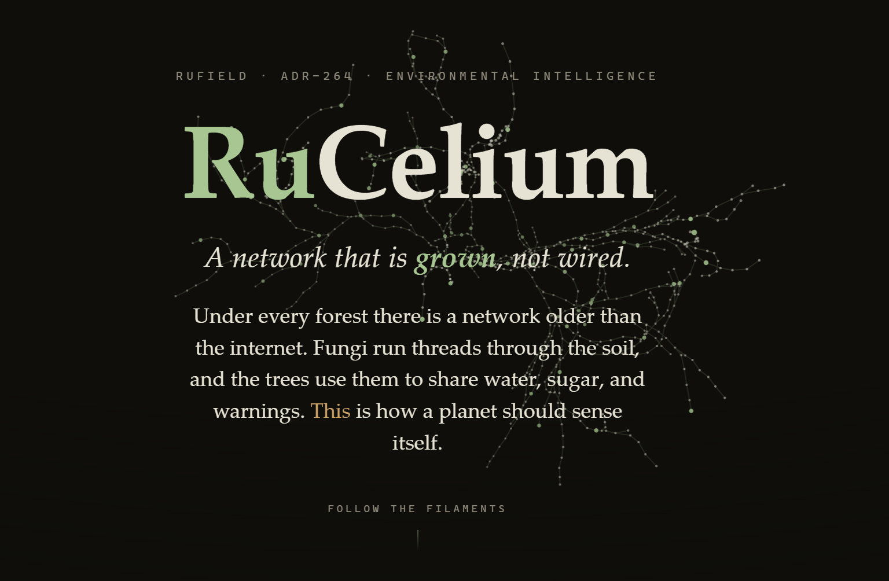

# RuCelium

> **A network that is grown, not wired.**

RuCelium is a research concept for environmental intelligence: a shared fabric
that can receive observations from electronic and living systems, verify where
they came from, weigh how trustworthy they are, and preserve disagreement
instead of hiding it.

[**Explore the interactive RuCelium artifact →**](https://claude.ai/code/artifact/f36ad019-057a-45f8-9c87-d518456717c5)

## The idea in one minute

Nature already contains sensing networks. Fungi move signals through soil. Trees
change their electrical behavior under stress. Hives carry acoustic, chemical,
weight, and pollen information about their region.

RuCelium asks: **what if those signals could participate safely in the same
evidence network as conventional sensors?**

The fabric follows a simple discipline:

1. **Verify** every signed measurement and its source.
2. **Calibrate** how much weight that source should receive.
3. **Record contradictions** instead of forcing false agreement.
4. **Corroborate across independent sites** before increasing confidence.

That makes unusual observations useful without making them unquestionable.

## What could become a sensor?

### Sentinel forests

Electrodes observe the normal electrical signatures of trees and fungal
colonies, then flag changes associated with drought, heat, pests, or poisoning.

### An ecosystem immune system

Electroactive microbial films in drains and waterways react to toxins. Chemical
sensors cross-check the signal, while the evidence graph helps trace a
disturbance upstream.

### An airborne DNA observatory

An acoustic or chemical anomaly triggers an air sample. Sequencing then
identifies which species were present, adding a biological census to the graph.

### Hives as instruments

A beehive's sound, weight, chemistry, and pollen DNA combine into a local
measure of pollinator and regional ecosystem health.

## Safety before certainty

Living systems are noisy and easy to misread. RuCelium therefore treats a
biological signal as **capped evidence**—just as it would an uncertain radio
observation—until independent measurements and repeated results justify more
confidence.

These examples are a research track, not a product roadmap. The point is not to
believe strange signals quickly. The point is to build the verification
discipline that makes them safe to investigate.

## Context

RuCelium is presented as part of **RuField ADR-264: Environmental
Intelligence**. The interactive artifact introduces the broader “one fabric,
four layers” concept and its visual narrative.

- [Open the interactive artifact](https://claude.ai/code/artifact/f36ad019-057a-45f8-9c87-d518456717c5)
- [View the hero image](docs/images/rucelium-hero.png)

## Status

**Concept and research exploration.** This repository currently documents the
idea and provides a public entry point to the interactive presentation.
